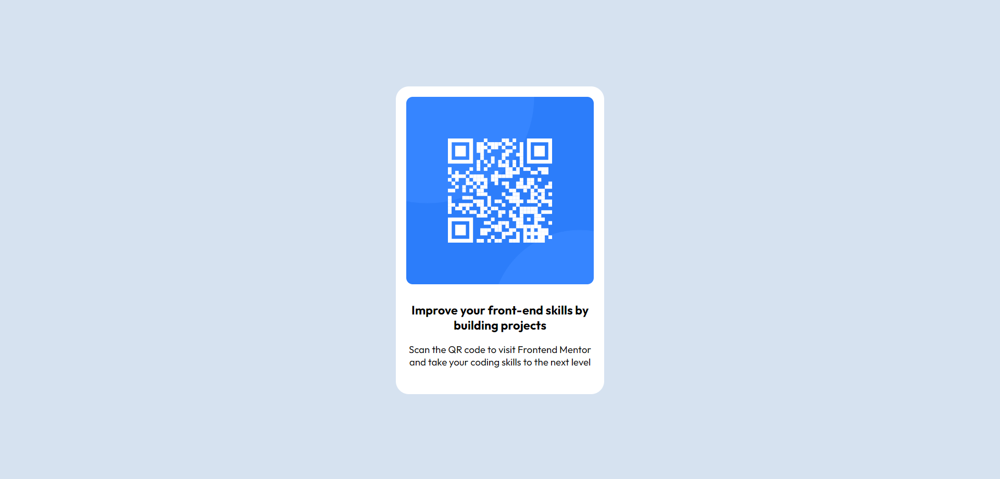

# Frontend Mentor - QR code component solution

This is a solution to the [QR code component challenge on Frontend Mentor](https://www.frontendmentor.io/challenges/qr-code-component-iux_sIO_H) 

## Table of contents

- [Overview](#overview)
  - [Screenshot](#screenshot)
  - [Links](#links)
- [My process](#my-process)
  - [Built with](#built-with)
  - [What I learned](#what-i-learned)
  - [Continued development](#continued-development)
  - [Useful resources](#useful-resources)
- [Author](#author)

**Note: Delete this note and update the table of contents based on what sections you keep.**

## Overview

### Screenshot




### Links

- Solution URL: [Add solution URL here](https://your-solution-url.com)
- Live Site URL: [Add live site URL here](https://your-live-site-url.com)

## My process

### Built with

- HTML
- CSS (Flexbox)

### What I learned
Use this code snippet in <body> tag to align its children vertically and horizontally.


```css
body {
  min-height: 100vh;
  display: flex;
  justify-content: center;
  align-items: center;
}
```

### Continued development

Continuing review, learn & practice Flexbox

### Useful resources

- [A Complete Guide to Flexbox](https://css-tricks.com/snippets/css/a-guide-to-flexbox/#aa-flexbox-properties) - This is an amazing article for reviewing Flexbox knowledge. I'd recommend it to anyone still learning this concept.


## Author
- Giang Tuan Hien 


